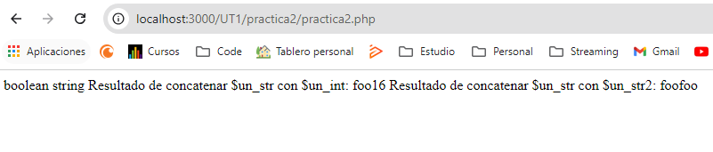
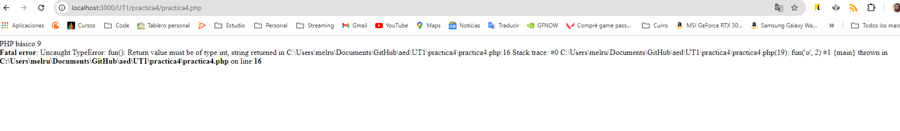
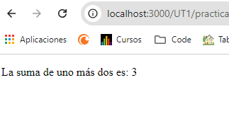
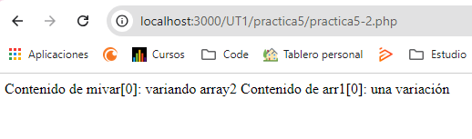

## Prácticas
1. [Practica 1](UT1/practica1)  
## Practica 1
Crear el script sustituyendo “alumno” por nuestro
nombre completo. Tomar captura de pantalla del resultado
```
<?php
echo "<p style='background: pink'>Soy alumno. Este es mi primer script php";
echo "</p>";
phpinfo();
PHP básico 5
?>
```


## Práctica 2 
```
<?php
$un_bool = TRUE; // un valor booleano
$un_str = "foo"; // una cadena de caracteres
$un_str2 = 'foo'; // una cadena de caracteres
$un_int = 12; // un número entero
echo gettype($un_bool); // imprime: boolean
echo gettype($un_str); // imprime: string
// Si este valor es un entero, incrementarlo en cuatro
if (is_int($un_int)) {
 $un_int += 4;
}
// Si $un_bool es una cadena, imprimirla
// (no imprime nada)
if (is_string($un_bool)) {
 echo "Cadena: $un_bool";
}
?>
```
Crear el script anterior. Modificarlo para sumar a $un_str el valor de $un_int y
mostrarlo en pantalla ¿ qué ocurre ? .
Sumar $un_str con $un_str2 ¿ qué ocurre ? ¿ se puede concatenar una cadena con comillas
simples con una con comillas dobles ?  




### Explicación de los Resultados

1. **Concatenar `$un_str` con `$un_int`:**
   - Cuando concatenas una cadena con un entero en PHP, el entero se convierte en una cadena y luego se concatenan.
   - **Resultado:** `"foo12"`

2. **Concatenar `$un_str` con `$un_str2`:**
   - Aquí simplemente concatenas dos cadenas.
   - **Resultado:** `"foofoo"`

**Nota sobre comillas simples y dobles:**

- Las comillas simples (`'`) en PHP no interpretan variables dentro de la cadena. Por ejemplo, `'foo'` siempre será `"foo"` y no interpretará ninguna variable dentro.
- Las comillas dobles (`"`) permiten la interpretación de variables y secuencias de escape, así que `"foo"` es interpretado como `"foo"` y las variables dentro de la cadena serán reemplazadas por su valor.

Por lo tanto, la concatenación entre cadenas con comillas simples y dobles funcionará igual en el contexto de la concatenación, porque estás concatenando cadenas con cadenas, no variables.

### Práctica 3
```
<html>
 <head>
 <meta charset="UTF-8">
 <title></title>
 </head>
 <body>
 <?php
 function sum( int $a, int $b): int {
 return $a + $b;
 }
 echo "<p> la suma de uno más dos es: ";
 $resultado = sum(1,2);
 print sum(1,2);
 echo "</p>"
 ?>
 </body>
</html>
```

Realizar el código anterior y tomar captura de pantalla del resultado. ¿qué es lo
que ha ocurrido ?. Poner código html antes de la declaración de strict_types y probar de
nuevo ¿ qué ocurre ahora ?

   Si el declare está al principio me da error 
   
   

Nota para mí: las declaraciones de tipo deben siempre estar al principio.

### Practica 4
Tomar captura de pantalla de: ( y explicar lo ocurrido )
- probar el código anterior ¿ da error ? Por qué ?
- quitar el comentario a: return $a; ¿ da error ahora ?por qué ?
- quitar comentario a: print fun(“e”,3); ¿ da error ?



Al descomentar return $a;, la función intentará devolver una cadena ("o"), lo que causará un error debido a que el tipo de retorno debe ser int.

Mensaje de Error:
Fatal error: Return value of fun() must be of the type int, string returned


La función fun está declarada para devolver un valor de tipo int. Al devolver $a, que es una cadena, PHP produce un error de tipo estricto porque la cadena no cumple con el tipo int esperado.

#### Conclusión
Probar el código original (print fun(1, 2);): La ejecución es correcta y muestra 2, ya que el valor de retorno es del tipo esperado (int).
Descomentar return $a;: Genera un error porque return $a; intenta devolver una cadena ("o") en lugar de un entero (int).

### Practica 5
```
<?php
$foo = 'Bob'; // Asigna el valor 'Bob' a $foo
$bar = &$foo; // Referencia $foo vía $bar.
$bar = "Mi nombre es $bar"; // Modifica $bar...
echo $foo; // $foo también se modifica.
echo $bar;
?>
```
Probar el código anterior. Probar ahora con números ¿ también funcionan las
referencias ?
__Respuesta:__ Sí, las referencias en PHP funcionan tanto con cadenas como con números. Cuando asignas una variable por referencia, cualquier cambio realizado en una de las variables también se reflejará en la otra, ya que ambas apuntan al mismo espacio en memoria.

### Practica __
__var_dump($mivar)__ nos muestra el contenido de la variable __$mivar__ 

Crear un array: $mivar = []; Introducir datos: array_push($mivar,”uno”); y hacer una asignación a otras variables. Una por referencia y la otra por valor:  
$arr1 = $mivar;
$arr2 = &$mivar;
modificar la posición cero de esas variable : $arr1[0] = “una variación”; $arr2[0] =
“variando array2 ”;
y mostrar el contenido de $mivar[0] y $arr1[0]
¿ qué es lo que ha ocurrido ? ( tomar captura de pantalla y explicarlo )

Resultado 



__Explicación__  

Se crea un array $mivar y se le añade el valor "uno".
Se asigna $mivar a $arr1 (por valor), lo que significa que $arr1 ahora tiene una copia de los datos de $mivar.
Se asigna $mivar a $arr2 (por referencia), lo que significa que ambos apuntan al mismo array en memoria.

__Modificaciones:__  

Al modificar $arr1[0], cambias solo el contenido de $arr1. Esto no afecta a $mivar porque $arr1 es una copia.
Al modificar $arr2[0], cambias el contenido de $mivar, ya que $arr2 es una referencia a $mivar. Por lo tanto, cualquier cambio en $arr2 se refleja en $mivar.
__Conclusión:__  

$arr1 y $mivar son diferentes: $arr1 tiene el valor "una variación", mientras que $mivar tiene "variando array2". Esto ilustra cómo las referencias permiten que las variables compartan el mismo espacio en memoria, mientras que las asignaciones por valor crean copias independientes de los datos.

