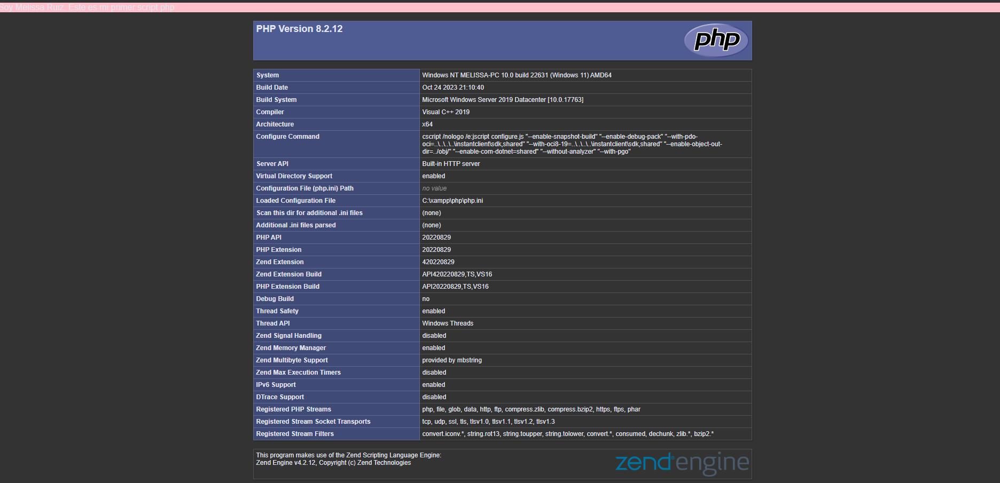

## Practica 1
Crear el script sustituyendo “alumno” por nuestro
nombre completo. Tomar captura de pantalla del resultado
```
<?php
echo "<p style='background: pink'>Soy alumno. Este es mi primer script php";
echo "</p>";
phpinfo();
PHP básico 5
?>
```



